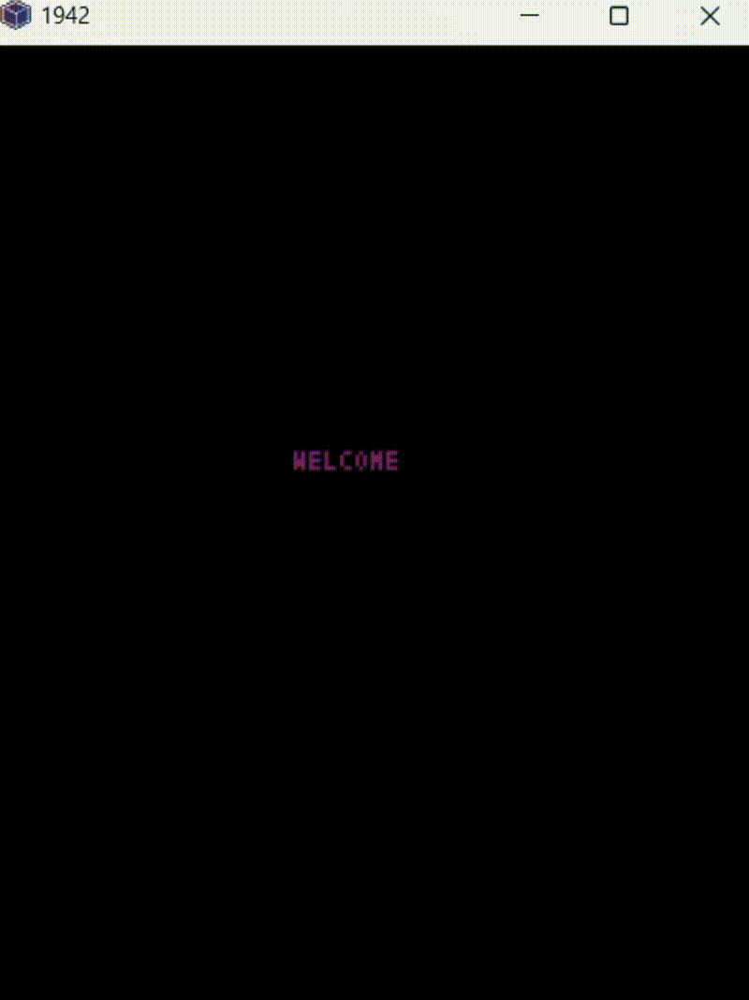

# ✈️ 1942 Game (Pyxel)

## Index

1. [Overview](#overview)
2. [Features](#features)
3. [Technologies Used](#technologies-used)
4. [Installation](#installation)
5. [Controls](#controls)
6. [Project Description](#project-description)
   - [Overview](#overview-1)
   - [Detailed Classes Description](#detailed-classes-description)
7. [Game Explanation](#game-explanation)
8. [Conclusion](#conclusion)




## Overview

This is a simple recreation of the classic *1942* arcade game, built using the Pyxel library in Python. It was our first programming project, designed to learn the basics of game development, object-oriented programming, and handling game logic.

## Features

- Player-controlled airplane
- Enemy waves
- Shooting mechanics
- Basic collision detection

## Technologies Used

- Python
- Pyxel (2D game engine)

## Installation

1. Make sure you have Python installed.
2. Install Pyxel by running:
   ```sh
   pip install pyxel
   ```
3. Clone this repository:
   ```sh
   git clone <repository_url>
   ```
4. Navigate to the project folder:
   ```sh
   cd 1942-main
   ```
5. Run the game:
   ```sh
   python main.py
   ```

## Controls

🕹️ In the opening screen press 'F' to see controls and features

↔️ Arrow keys or WASD to move.

⌨️ Spacebar to shoot.

🤸‍♂️ Press "Z" to perform a loop and become invincible for a short time (can be used twice per game).

## Project Description

### Overview

The goal of the game is to destroy as many enemies as possible to achieve the highest score. The main elements of the game are the player's plane, enemies, bullets, and power-ups. The game includes a start menu with three options: start the game, view controls and information, or quit the game. A game-over scene allows the player to restart the game.

### Detailed Classes Description

The game is developed using Python’s Pyxel library, with ten different classes:

#### Board Class

- Manages all game elements, including controls, collisions, and rendering.

#### Plane Class

- Controls player movement and shooting mechanics.

#### Enemy Classes

- Five different enemy classes, each with unique behaviors and movement patterns.
- All enemies are managed within a general "Enemies" class.

#### Bullet Classes

- Separate classes for player and enemy bullets.
- The player can obtain a power-up for double shooting if they eliminate all "Liang" enemies in a round.

#### Data File

- Contains constants used throughout the game, allowing easy modifications.

#### Main File

- Runs the game by creating a "Board" object and initializing the Pyxel loop.

## Game Explanation

- The game starts with a title screen where the player can start(S), view controls(F), or exit(Q).
- After starting, the player moves a plane using the arrow keys or WASD and shoots with the spacebar.
- Different types of enemies appear:
  - **Regular Enemies**: 10 points, 1 life, simple diagonal movement.
  - **Red Enemies**: 10 points, 1 life, circular movement.
  - **Bombardiers**: 20 points per kill, 5 lives, dangerous on contact.
  - **Super Bombardiers**: 15 lives, shoots multiple bullets at the player.
- **Bonuses**:
  - Destroying all "Liang" enemies grants double shooting power for a few seconds.
  - Pressing "Z" performs a loop and grants temporary invincibility (usable twice per game).

## Conclusion

The project helped in understanding Pyxel, structuring classes effectively, and handling animations. The biggest challenges were learning Pyxel, organizing game elements, and implementing animations like explosions and loops. Overall, it was an excellent learning experience in game development and teamwork.
